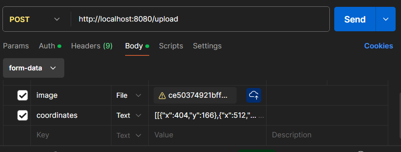

# Strikethrough Identification Backend

## Quick start
Install python libraries from `requirements.txt` or use `conda` to create your own virtual environment.
```bash
conda config --append channels pytorch        
conda create --name <your_env_name> --file cyclegan_requirements.txt
conda activate <your_env_name>
```
Start your redis server by executing `redis-server` and `rq worker`.
To start the backend server, execute
```bash
bash bin/run.sh
```
You can configure the port number from `wsgi.py`. The default port number is `8080`.
Do not forget to edit `api/config.py` to edit the `cyclegan.py` configuration.

You can use the pre-trained model `best_f1.pth` from the original repository https://github.com/RaphaelaHeil/strikethrough-removal-cyclegans (strikethrough_identification) and save in `api/model`.

## APIs
### `/upload`
We use `formdata` with two fields: `coordinates` and `image`. 
```JSON
[
    [
        {"x":404,"y":166},
        {"x":512,"y":166},
        {"x":512,"y":186},
        {"x":404,"y":186},
        {"description":"significant"}
    ],
    [
        {"x":516,"y":166},
        {"x":609,"y":166},
        {"x":609,"y":186},
        {"x":516,"y":186},
        {"description":"personal"}
    ]
]
```


## Remark
Here are some bottlenecks.
- This flash application cannot efficiently handle multiple requests. 
- The function `chop_images` in `utils.py` is serialized and slow. This process should be parallelized.